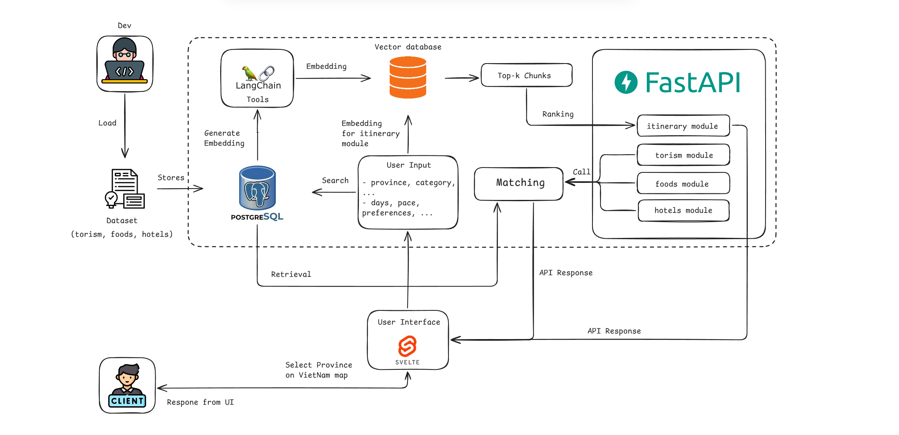

# Project CT - Smart Tourism System

## 1. Overview

A modern AI-assisted tourism information system providing:
- Tourist destinations, food, hotels
- Real-time weather
- **RAG** (Retrieval-Augmented Search) for tourism knowledge
- **Rule-based** itinerary recommendation enhanced with RAG context

Used for Vietnam tourism data: attractions, foods, hotels, maps, and itinerary suggestions.

## 2. Key Features

**Tourism Information Management**
- Tourist attractions
- Local cuisine
- Hotels and accommodations

**Real-Time Weather Integration**
- Current weather conditions for selected destinations

**RAG-Based Knowledge Retrieval**
- Uses vector search to retrieve relevant tourism information
- Enhances responses with contextual data

**Rule-Based Itinerary Recommendation**
- Generates daily travel schedules (morning, afternoon, evening)
- Combines user preferences with RAG-retrieved context
- Ensures logical pacing and location constraints

## 3. System Architecture

The system follows a modular architecture consisting of:

- **Backend**
    - Handles API requests
    - Manages data processing and recommendation logic
    
- **Frontend**
    - Interactive web interface for users
    - Displays maps, destinations, and itineraries
- **Database**
    - Stores tourism data (places, food, hotels)
    - Supports structured queries and retrieval

- **AI Module**
    - Embedding generation and vector search
    - RAG-based context retrieval for itinerary enhancement

## 4. Tech Stack

- **Languages:** Python, JavaScript

- **Backend:** FastAPI, Uvicorn
- **Frontend:** Svelte, HTML/CSS
- **Database:** PostgreSQL
- **Visualization:** mathplotlib, seaborn
- **Embedding and Data Processing:** LangChain, Pandas, NumPy
- **AI Module:** Pytorch, sentence-transformers, RAG, multilingual-e5-small (HF model)

## 6. How to Run

