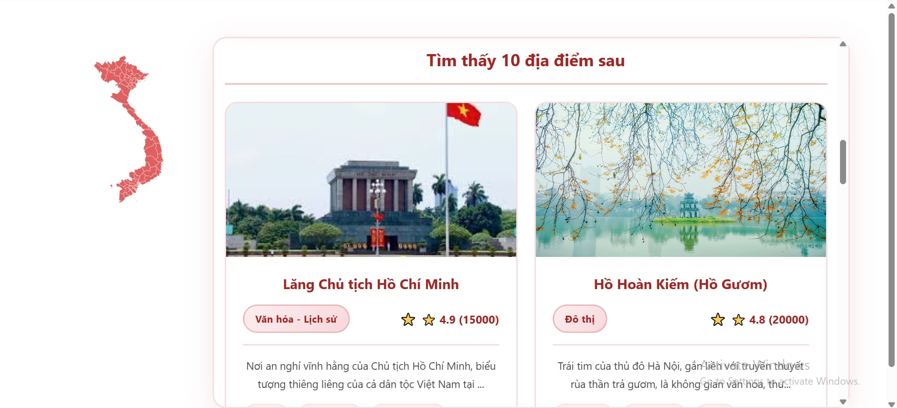
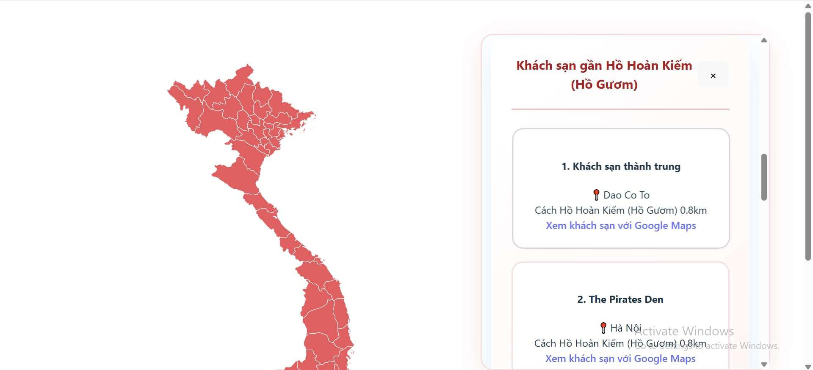
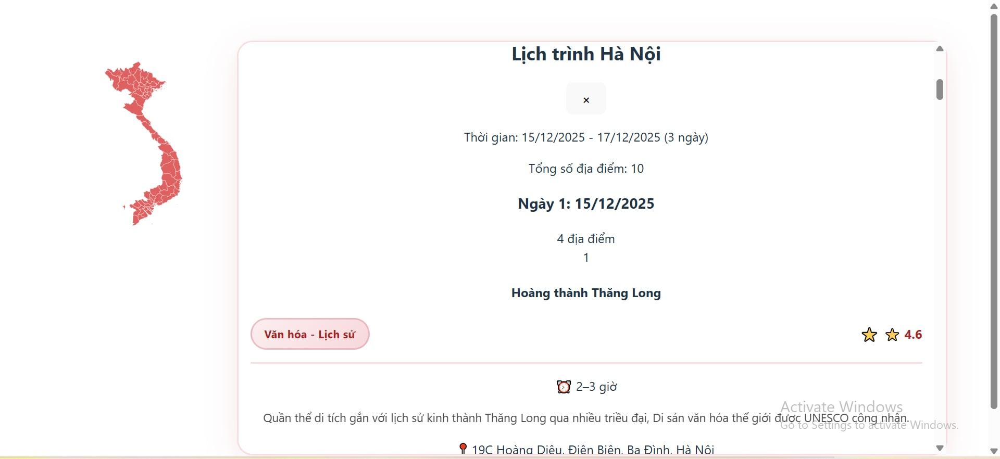

# Project CT - Smart Tourism System

## 1. Overview

A modern AI-assisted tourism information system providing:
- Tourist destinations, food, hotels
- Real-time weather
- **RAG** (Retrieval-Augmented Search) for tourism knowledge
- **Rule-based** itinerary recommendation enhanced with RAG context

Used for Vietnam tourism data: attractions, foods, hotels, maps, and itinerary suggestions.

## 2. Key Features

**Tourism Information Management**
- Tourist attractions


- Local cuisine


- Hotels and accommodations


**Real-Time Weather Integration**
- Current weather conditions for selected destinations

**RAG-Based Knowledge Retrieval**
- Uses vector search to retrieve relevant tourism information
- Enhances responses with contextual data


**Rule-Based Itinerary Recommendation**
- Generates daily travel schedules (morning, afternoon, evening)
- Combines user preferences with RAG-retrieved context
- Ensures logical pacing and location constraints


## 3. System Architecture

The system follows a modular architecture consisting of:

- **Backend**
    - Handles API requests
    - Manages data processing and recommendation logic
    
- **Frontend**
    - Interactive web interface for users
    - Displays maps, destinations, and itineraries
- **Database**
    - Stores tourism data (places, food, hotels)
    - Supports structured queries and retrieval

- **AI Module**
    - Embedding generation and vector search
    - RAG-based context retrieval for itinerary enhancement

## 4. Tech Stack

- **Languages:** Python, JavaScript

- **Backend:** FastAPI, Uvicorn
- **Frontend:** Svelte, HTML/CSS
- **Database:** PostgreSQL
- **Visualization:** mathplotlib, seaborn
- **Embedding and Data Processing:** LangChain, Pandas, NumPy
- **AI Module:** Pytorch, sentence-transformers, RAG, multilingual-e5-small (HF model)

## 6. How to Run

### 6.1. Requirements

- **Python:** 3.10 – 3.12  
- **Node.js:** 18 or higher  
- **npm** or **yarn**  
- (Recommended) **Git Bash** on Windows  
- (Optional) **Docker & Docker Compose**

### 6.2. Option 1: Run with Docker (Recommended)

This is the easiest way to run the full system without manual dependency installation.

#### Step 1: Navigate to the project directory
```bash
cd smart-tourism-system
```

#### Step 2: Build and start the system
```bash
docker compose up --build
```

#### Step 3: Access the application

- Frontend: http://localhost:5500

- Backend API (Swagger UI): http://localhost:8000/docs

### 6.3. Option 2: Run Locally (Manual Setup)

#### 6.3.1. Run Backend

- Step 1: Create and activate a virtual environment

```bash
python -m venv venv
source venv/Scripts/activate   # Windows (Git Bash)
```
- Step 2: Install backend dependencies
```bash
pip install -r requirements_dev.txt
```

- Step 3: Start the FastAPI server
```bash
cd backend
uvicorn app.api.main:app --reload
```

**Backend** will be available at:

- http://localhost:8000

- API documentation: http://localhost:8000/docs

### 6.3.2. Run Frontend

- Step 1: Navigate to the frontend directory
```bash
cd frontend/my-vietnam-map
```

- Step 2: Install frontend dependencies
```bash
npm install
```

- Step 3: Start the frontend development server
```bash
npm run dev -- --host
```

**Frontend** will be available at:

- http://localhost:5500